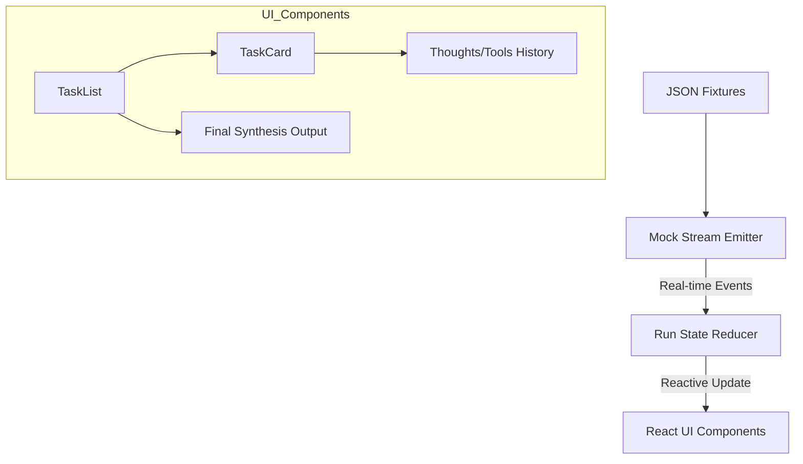

# JcurveIQ Agent Panel - Architecture Breakdown

This document explains the technical flow and logic behind the real-time research pipeline visualization.

## 🔄 The Real-Time Flow
The system operates as a unidirectional data flow, ensuring that the UI remains a pure reflection of the underlying research events.

### 1. Data Layer (JSON Fixtures)
- Located in `src/mock/fixtures/`.
- Contains a sequence of event objects (`task_spawn`, `tool_call`, `task_output`, etc.).
- These represent the raw logs that an AI agent would produce.

### 2. Stream Layer (`useMockStream.js`)
- Acts as a **Simulated WebSocket**.
- It iterates through the JSON events and "emits" them using `setTimeout`.
- **Random Latency**: Each event has a randomized delay (400ms – 1200ms) to simulate real network conditions and agent processing time.

### 3. State Layer (`useRunState.js`)
- Uses a **React Reducer** to manage complex transitions.
- **Why a Reducer?** Because multiple events (like tool calls and partial outputs) happen rapidly. A reducer ensures that the state updates are predictable and "atomic".
- **Parallel Logic**: Detects the `is_parallel` flag in events to trigger the multi-column grid layout.

### 4. UI Layer (React Components)
- **`AgentRunPanel`**: The root orchestrator that handles fixture selection and run controls.
- **`TaskList`**: Scans the tasks and dynamically decides when to use a `ParallelGroup` (grid) versus a sequential `TaskCard`.
- **`TaskCard`**: Reacts to status changes:
  - `running`: Pulsing blue indicator + auto-expand.
  - `completed`: Green checkmark.
  - `skipped`: Muted gray (for optimized paths).
  - `failed`: Red alert (for safety or API errors).

## 🧩 Diagram (Logic Flow)
Below is the visual map of the architecture:

## 🛠️ Key Design Decisions
- **Optimistic Rendering**: The UI updates immediately when an event is received.
- **Decoupled Architecture**: The UI doesn't know the data is "mocked". You can replace the mock hook with a real WebSocket hook without changing a single line of component code.
- **Persona Optimization**: "Agent Thoughts" are collapsed by default to prioritize results for Financial Analysts, while keeping technical logs accessible for transparency.
